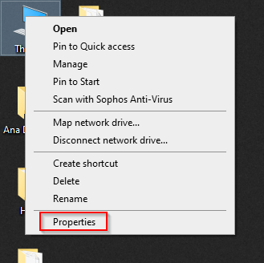
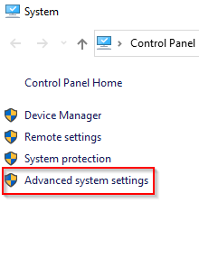

## Preduslov

Da bi se krenulo sa SagaShop aplikacijom, kandidat mora da ima minimum srednji nivo znanja iz Java programskog jezika
i osnovni nivo znanja iz Spring i Hibernate tehnologija.

- Ukoliko kandidat nema znanje iz Java programskog jezika, neophodno je da se 2-3 meseca posveti izučavanju videa i materijala
- Neophodno je preći [Hibernate JPA obuku](http://rdevops.razvoj.saga.co.yu/BackendJavaObukaCollection/_git/HibernateJpa?path=%2FREADME.md)
- Neophodno je preći [Spring Core obuku](http://rdevops.razvoj.saga.co.yu/BackendJavaObukaCollection/_git/SpringCore?path=%2FReadme.md)
- Neophodno je preći [Spring Test obuku](http://rdevops.razvoj.saga.co.yu/BackendJavaObukaCollection/_git/SpringTest?path=%2FREADME.md)
- Neophodno je preći [Spring Security obuku](http://rdevops.razvoj.saga.co.yu/BackendJavaObukaCollection/_git/SpringSecurity)

Potrebno je instalirati:

- Java 11 - dodati JAVA_HOME environment varijablu




Otići na karticu Environment Variables i za JAVA_HOME varijablu podesiti putanju do instalirane Java 11

- IntelliJ Idea
- MySql
- Maven i u environment path staviti putanju do maven/bin foldera
- Instalirati git 
- Uraditi clone projekta - git clone
  http://rdevops.razvoj.saga.co.yu/BackendJavaObukaCollection/SagaShop/_git/SagaShop
- Kreirati 2 šeme u bazi podataka
  - razvojnu - izvršiti skritu create_schema.sql iz src/resources foldera
  - testnu - izvršiti skritu create_schema.sql iz test/resources foldera

# Uvod

Ideja je da se ide u fazama, od osnovih stvari, preko security-ja i složenijih funkcionalnosti, do uvođenja novih tehnologija.

Faze:

- Osnovna obuka - 2 meseca
  - Faza I - 2-3 nedelje - osnovni Domenski model, maperi, DTO, DAO sloj, service sloj, rest sloj, CRUD operacije
  - Faza II - 1-2 nedelje - implementacija složenijih slučajeva korišćenja
  - Faza III - 1 nedelja -  uvođenje tokena kao spring security koncepta
  - Faza IV - 2 nedelje - Audit i verzionisanje
  - Faza V - 2 nedelje - Poslovna pravila, soring i paging
- Napredna obuka kroz faze
  - Faza VI - mesec dana (4-6 nedelja) - 10 dodataka projektu koje je neophodno poznavati
- Napredna obuka drugi deo
  - Faza VI.1 - BI Publisher - 2 nedelje
  - Faza VI.2 - Webservice-i i upload XML fajla - 2 nedelje
  
# Uputstvo za razvoj SagaShop aplikacije:

- Kada se klonira projekat dobiće se kostur projekta i implementirane CRUD operacije za Category domenski objekat
- Svi domenski objekti nasleđuju BaseEntity klasu koja u sebi ima ID
```  
@MappedSuperclass
public abstract class BaseEntity<K extends Serializable> implements Serializable {

  @Id
  @GeneratedValue(strategy = GenerationType.IDENTITY)
  private K id;

  public K getId(){
    return  id;
  }

  public void setId(K id){
    this.id = id;
  }
}
```
- Potrebno je pogledati kod, dao, service, rest, dto, mapper i domain slojeve
- Potrebno je pogledati testove. Za sada su implementirani unit rest testovi i integracioni servis testovi.
- U application.properties je stavljen property **spring.jpa.hibernate.ddl-auto = update**. Na taj način, kada se pokrene aplikacija, Hibernate će kreirati šemu i kasnije će raditi alter šeme kada se menja model. 
Za testnu bazu parametar je stavljen na create-drop (u test folderu kreirati resources folder i u njemu application.properties fajl).
- Za kreiranje testnih podataka koristi se Builder patern uz pomoć [Lombok](https://projectlombok.org/) biblioteke.
```
public class CategoryBuilder {

    public static Category categoryBelaTehnika() {
        return Category.builder()
                .name("Bela tehnika").description("Bela tehnika - sve na jednom mestu")
                .build();
    }

    public static Category categoryRacunari() {
        return Category.builder()
                .name("Računari i komponente").description("Računari i komponente - sve na jednom mestu")
                .build();
    }

}
```
- Kreirani su AbstractDAO interfejs i AbstractDAOImpl klasa u kojima će se nalaziti generičke CRUD operacije:

```java
import java.io.Serializable;
import java.util.Collection;
import java.util.List;

public interface AbstractDAO<T, PK extends Serializable> {
    T findOne(PK id);
    List<T> findAll();
    T save(T entity) throws DAOException;
    T merge(T entity) throws DAOException;
    void delete(T entity) throws DAOException;
    void deleteById(PK entityId) throws DAOException;
    void deleteAll(Collection<T> collection) throws DAOException;
    void flush();
    void deleteAll();
}
```
```java
import org.springframework.transaction.annotation.Transactional;
import rs.saga.obuka.sagashop.dao.AbstractDAO;

import javax.persistence.EntityManager;
import javax.persistence.PersistenceContext;
import java.io.Serializable;
import java.lang.reflect.ParameterizedType;
import java.util.Collection;
import java.util.List;

@SuppressWarnings({"unused", "WeakerAccess"})
public abstract class AbstractDAOImpl<T, PK extends Serializable> implements AbstractDAO<T, PK> {

    protected Class<T> clazz;

    @PersistenceContext
    protected EntityManager entityManager;

    @SuppressWarnings("unchecked")
    public AbstractDAOImpl() {
        this.clazz = (Class<T>) ((ParameterizedType) this.getClass().getGenericSuperclass())
                .getActualTypeArguments()[0];
    }

    protected Class<T> entityClass;

    public void setClazz(final Class<T> clazzToSet) {
        this.clazz = clazzToSet;
    }

    @Override
    public T findOne(PK id) {
        return entityManager.find(clazz, id);
    }

    @Override
    @SuppressWarnings("unchecked")
    public List<T> findAll() {
        return entityManager.createQuery("from " + clazz.getName()).getResultList();
    }

    @Override
    public T save(T entity) {
        T persistentEntity;

        entityManager.persist(entity);
        persistentEntity = entity;
        return persistentEntity;
    }

    @Override
    public T merge(T entity) {
        return entityManager.merge(entity);
    }

    @Override
    public void delete(T entity) {
        entityManager.remove(entity);
    }

    @Override
    public void deleteById(PK entityId) {
        T entity = findOne(entityId);
        if (entityId != null) {
            entityManager.remove(entity);
        }
    }

    @Override
    public void deleteAll(Collection<T> collection) {
        for (T t : collection) {
            delete(t);
        }
    }

    public void flush() {
        entityManager.flush();
    }

    @Transactional
    public void deleteAll() {
        deleteAll(findAll());
    }
}
```

- Kreiran je folder exception i u njemu dodat DAOException:

```java
public class DAOException extends Exception {

    public static final String ENTITY_NOT_FOUND = "{0} not found";

    public DAOException(final String pMessage) {
        super(pMessage);
    }

    public DAOException(final String pMessage, final Throwable throwable) {
        super(pMessage,throwable);
    }

    public DAOException(final Throwable throwable) {
        super(throwable);
    }

}
```
- Za Category domensku klasu je napravljena DAO, Service i Rest klasa i odgovarajući testovi.
- Implementirane su CRUD operacije
```java
public interface CategoryService {
    Category save(CreateCategoryCmd cmd) throws ServiceException;
    List<CategoryResult> findAll();
    CategoryInfo findById(Long id);
    void update(UpdateCategoryCmd CategoryDTO) throws ServiceException;
    void delete(Long id) throws ServiceException;
}
```
  - Za sve create i update operacije, DTO klase imaju sufiks Cmd
  - Za sve get objekat operacije, DTO klase imaju sufiks Info
  - Za sve get listu objekata operacije, DTO klase imaju sufiks Result
- Napravljen je maper koji će da kopira atribute iz Entity u DTO klase i obrnuto. Koristi se [MapStruct](https://mapstruct.org/).

- Za potrebe testiranja napravljene su sledeće abstract klase koje će klase za testiranje da nasleđuju u zavisnosti od sloja za koji se testiranje radi.
```java
package rs.saga.obuka.sagashop;

import org.junit.jupiter.api.extension.ExtendWith;
import org.springframework.boot.test.context.SpringBootTest;
import org.springframework.test.context.junit.jupiter.SpringExtension;

@ExtendWith(SpringExtension.class)
@SpringBootTest(classes = SagashopApplicationTest.class, webEnvironment = SpringBootTest.WebEnvironment.RANDOM_PORT)
public abstract class AbstractDAOTest {
}
```
```java
package rs.saga.obuka.sagashop;

import org.junit.jupiter.api.extension.ExtendWith;
import org.springframework.boot.test.context.SpringBootTest;
import org.springframework.test.context.junit.jupiter.SpringExtension;

@ExtendWith(SpringExtension.class)
@SpringBootTest(classes = SagashopApplicationTest.class, webEnvironment = SpringBootTest.WebEnvironment.RANDOM_PORT)
public abstract class AbstractIntegrationTest {
}
```
```java
package rs.saga.obuka.sagashop;

import com.fasterxml.jackson.databind.ObjectMapper;
import org.junit.jupiter.api.BeforeEach;
import org.junit.jupiter.api.extension.ExtendWith;
import org.springframework.beans.factory.annotation.Autowired;
import org.springframework.boot.autoconfigure.AutoConfigurationExcludeFilter;
import org.springframework.boot.autoconfigure.EnableAutoConfiguration;
import org.springframework.boot.context.TypeExcludeFilter;
import org.springframework.context.annotation.ComponentScan;
import org.springframework.context.annotation.Configuration;
import org.springframework.context.annotation.FilterType;
import org.springframework.test.context.ContextConfiguration;
import org.springframework.test.context.junit.jupiter.SpringExtension;
import org.springframework.test.web.servlet.MockMvc;
import org.springframework.test.web.servlet.setup.MockMvcBuilders;
import org.springframework.web.context.WebApplicationContext;

@ExtendWith(SpringExtension.class)
@ContextConfiguration
public abstract class AbstractUnitRestTest {

    protected MockMvc mockMvc;

    @Autowired
    private WebApplicationContext context;

    @Autowired
    protected ObjectMapper mapper;

    @BeforeEach
    public void setup() {
        mockMvc = MockMvcBuilders
                .webAppContextSetup(context)
                .build();
    }

    @Configuration
    @EnableAutoConfiguration
    @ComponentScan(basePackages = "rs.saga.obuka.sagashop",
            excludeFilters = {
                    @ComponentScan.Filter(type = FilterType.CUSTOM, classes = TypeExcludeFilter.class),
                    @ComponentScan.Filter(type = FilterType.CUSTOM, classes = AutoConfigurationExcludeFilter.class)})
    static class TestConfig {
    }
}
```
- Za integracione testove je neophodno obrisati podatke posle svakog testa, i to je implementirano u AbstractIntegrationTest klasi.

### Literatura
**Mappings**
- http://ppgitlab/java-middleware/baza-znanja/blob/master/mkdocs/docs/mappings/MapStruct.md

**Lombok**
- https://projectlombok.org/.